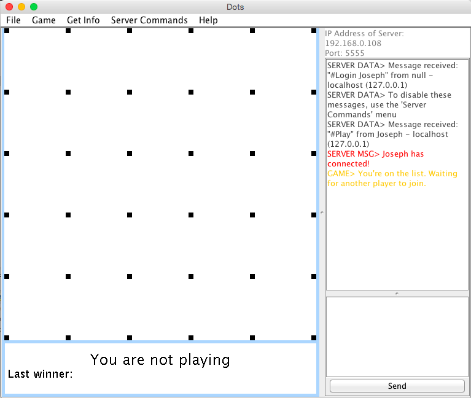
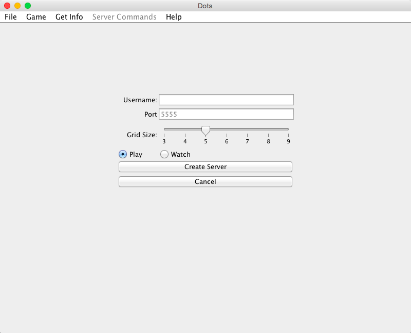
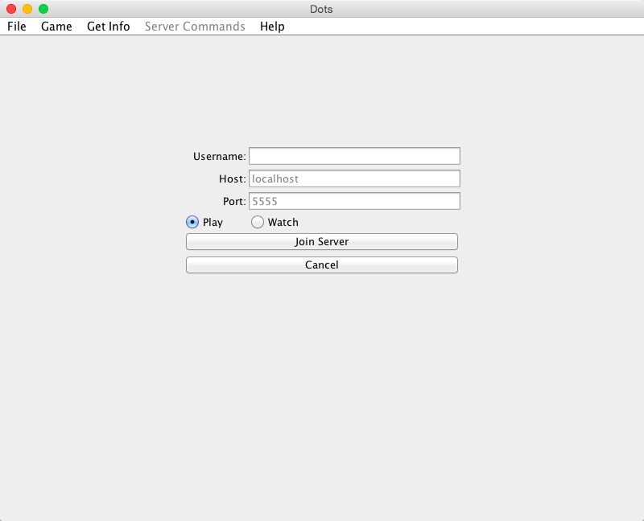
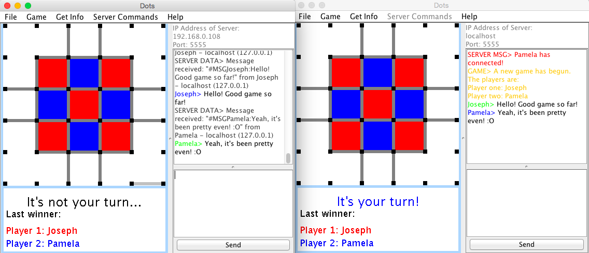
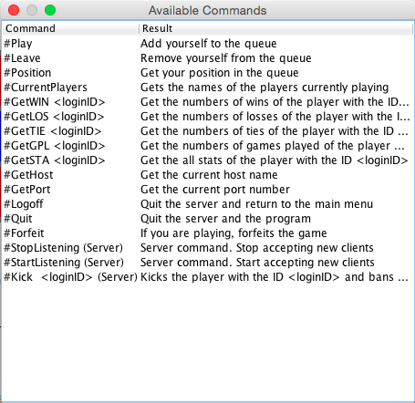

# SEG2105-A7-Dots

"Dots and Boxes" game created for SEG2105 assignment at University of Ottawa
GUI for a "Dots and Boxes" game, playable over a network.

View the Wikipedia entry for the game [here](http://en.wikipedia.org/wiki/Dots_and_Boxes)<br />
Built on top of the [Object Client/Server Framework](http://www.site.uottawa.ca/school/research/lloseng/supportMaterial/ocsf/ocsf.html)

Written in Java, in Eclipse. Repository contains Eclipse project.

## Screenshots

<br />
*Hosting a server*

<br />
*Creating and joining a server*

<br />
*Playing a game*

<br />
*Commands availabe to users*

## License

```
The MIT License (MIT)

Copyright (c) 2014 Joseph Roque, Matthew L'Arrivee

Permission is hereby granted, free of charge, to any person obtaining a copy
of this software and associated documentation files (the "Software"), to deal
in the Software without restriction, including without limitation the rights
to use, copy, modify, merge, publish, distribute, sublicense, and/or sell
copies of the Software, and to permit persons to whom the Software is
furnished to do so, subject to the following conditions:

The above copyright notice and this permission notice shall be included in all
copies or substantial portions of the Software.

THE SOFTWARE IS PROVIDED "AS IS", WITHOUT WARRANTY OF ANY KIND, EXPRESS OR
IMPLIED, INCLUDING BUT NOT LIMITED TO THE WARRANTIES OF MERCHANTABILITY,
FITNESS FOR A PARTICULAR PURPOSE AND NONINFRINGEMENT. IN NO EVENT SHALL THE
AUTHORS OR COPYRIGHT HOLDERS BE LIABLE FOR ANY CLAIM, DAMAGES OR OTHER
LIABILITY, WHETHER IN AN ACTION OF CONTRACT, TORT OR OTHERWISE, ARISING FROM,
OUT OF OR IN CONNECTION WITH THE SOFTWARE OR THE USE OR OTHER DEALINGS IN THE
SOFTWARE.

```
